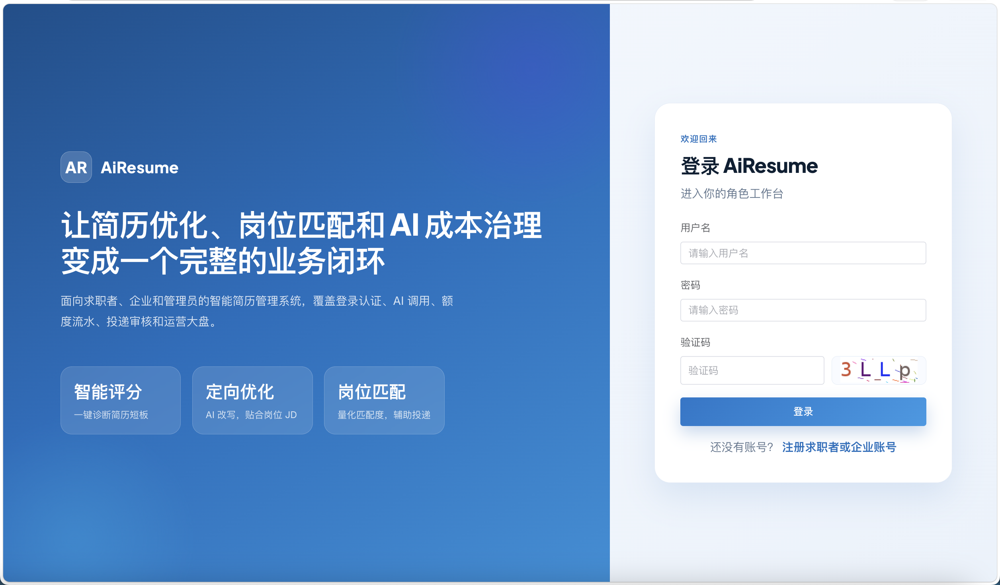
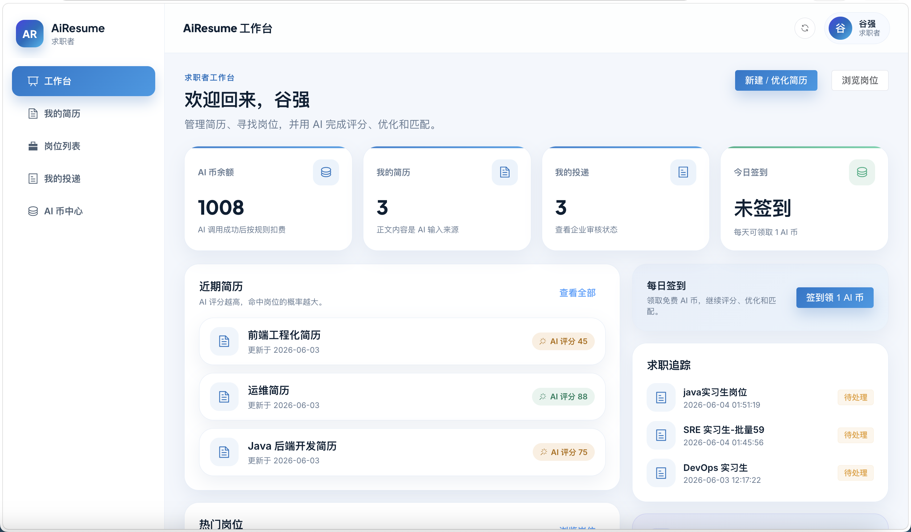
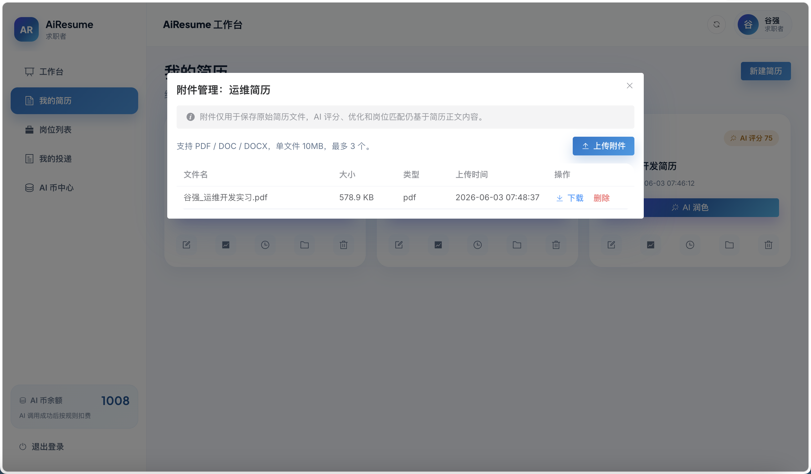
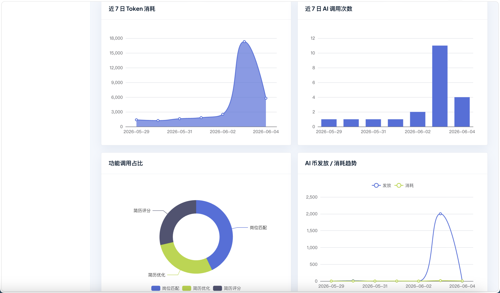
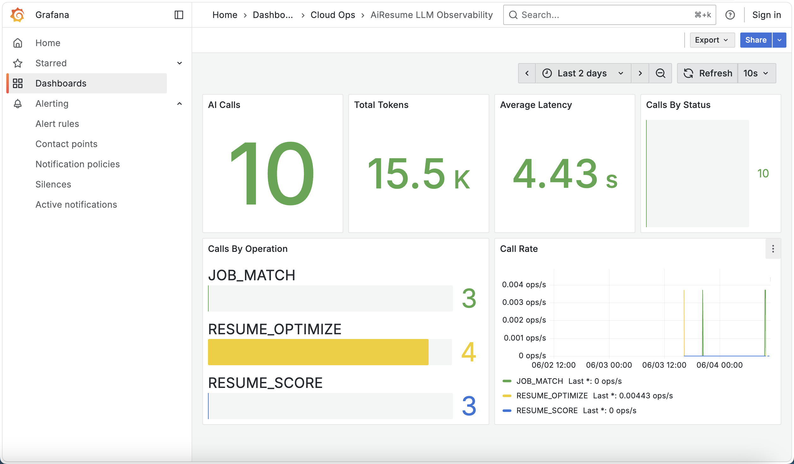
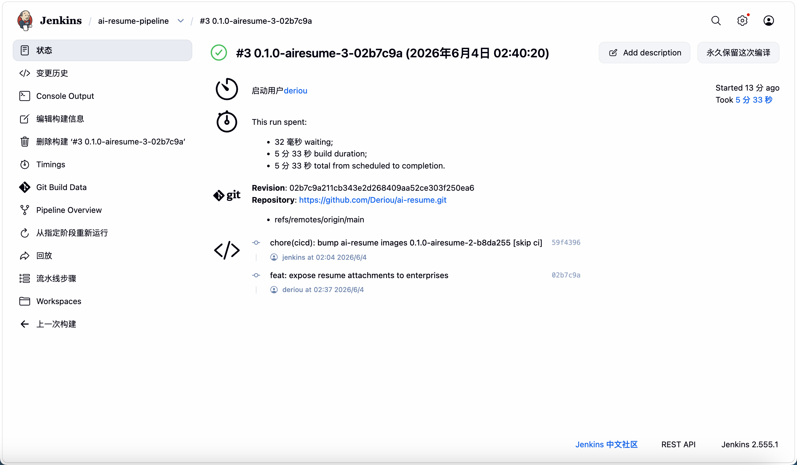

# AiResume 智能简历优化系统

AiResume 是一个面向求职场景的简历智能优化与岗位匹配系统。项目完成了求职者、企业、管理员三类角色的核心业务闭环，并在基础功能之外补充了 Redis 多场景应用、AI 额度治理、LLM 调用监控、K3s 部署和 Jenkins GitOps 发布链路。

> 项目定位: 课程/实训答辩项目 + LLM 应用工程化实践。

## 功能预览

### 登录与角色入口



### 求职者工作台



### 简历附件上传



### 管理员统计大盘



### LLM 可观测性



### Jenkins GitOps 流水线



## 已完成功能

### 求职者

- 注册登录、图形验证码、token 登录态。
- 简历创建、编辑、删除、列表查看。
- PDF / DOC / DOCX 简历附件上传、下载、删除。
- DeepSeek 简历评分、简历优化、岗位匹配。
- 岗位浏览、投递岗位、查看投递状态。
- AI 币余额和扣费流水查看。

### 企业

- 发布岗位、编辑岗位、关闭岗位。
- 查看收到的投递。
- 对投递进行查看、通过、拒绝处理。
- 形成“岗位发布 -> 用户投递 -> 企业审核”的岗位侧闭环。

### 管理员

- 用户管理。
- 岗位和投递数据查看。
- AI 币发放与调整。
- 业务统计大盘。
- LLM 调用、token 消耗、AI 额度数据统计。

## 技术亮点

- **Redis 多场景**: 图形验证码、登录态、签到 bitmap、热门岗位缓存。
- **AI 成本治理**: 调用前校验 AI 币余额, 调用成功后扣费, 记录 token、耗时和流水。
- **LLM 可观测性**: Spring Boot Actuator + Micrometer + Prometheus + Grafana。
- **工程化部署**: Docker 镜像、K3s namespace、Deployment、Service、Ingress、PVC。
- **CI/CD**: Jenkins Pipeline 构建前后端镜像, 推送阿里云 ACR, 回写 K8s 清单并滚动发布。
- **统一后端基础能力**: 统一响应结构、全局异常处理、traceId、分页、三角色 RBAC 拦截。

## 技术栈

| 层级 | 技术 |
|---|---|
| 前端 | Vue 3, TypeScript, Vite, Element Plus, Pinia, Vue Router, ECharts |
| 后端 | Java 21, Spring Boot 3, MyBatis-Plus, Spring Validation, Actuator |
| 数据 | MySQL 8, Redis 7 |
| AI | DeepSeek Chat API |
| 监控 | Micrometer, Prometheus, Grafana |
| 部署 | Docker, Nginx, K3s, Traefik Ingress, Jenkins, 阿里云 ACR |

## 系统架构

```text
Browser
  |
  v
Vue 3 Web (Nginx / Vite)
  |
  v
Spring Boot API
  |------------------> MySQL: 业务主数据
  |------------------> Redis: 验证码 / 登录态 / 签到 / 热点缓存
  |------------------> DeepSeek API: 简历评分 / 优化 / 岗位匹配
  |
  v
Actuator / Prometheus / Grafana

Jenkins -> Docker Image -> ACR -> K3s -> Ingress
```

## 快速启动

### 1. 准备环境

需要提前安装:

- JDK 21
- Node.js 20+
- Docker / Docker Compose

### 2. 启动 MySQL 和 Redis

```bash
docker compose up -d
```

首次启动 MySQL 会自动执行:

```text
sql/schema.sql
sql/data.sql
```

本地端口:

| 服务 | 地址 |
|---|---|
| MySQL | `127.0.0.1:3307/db_airesume` |
| Redis | `127.0.0.1:6380` |
| 后端 | `http://localhost:8080` |
| 前端 | `http://localhost:5173` |

### 3. 配置 DeepSeek Key

AI 评分、优化、匹配需要配置:

```bash
export DEEPSEEK_API_KEY=你的 DeepSeek API Key
```

如果不配置 Key, 登录、简历、岗位、投递、文件上传、AI 币和管理员大盘仍可运行, AI 调用会返回未配置 Key 的业务错误。

### 4. 启动后端

```bash
./mvnw spring-boot:run
```

健康检查:

```bash
curl http://localhost:8080/api/health
```

### 5. 启动前端

```bash
cd web
npm install
npm run dev
```

访问:

```text
http://localhost:5173
```

## 演示账号

| 角色 | 用户名 | 密码 |
|---|---|---|
| 求职者 | `user` | `user123` |
| 企业 | `enterprise` | `enterprise123` |
| 管理员 | `admin` | `admin123` |

更多演示数据见 [sql/data.sql](sql/data.sql)。

## 监控启动

启动 Prometheus 和 Grafana:

```bash
docker compose -f compose.monitoring.yaml up -d
```

访问地址:

| 服务 | 地址 | 默认账号 |
|---|---|---|
| Prometheus | `http://localhost:9090` | 无 |
| Grafana | `http://localhost:3001` | `admin / admin` |

后端 Prometheus 指标端点:

```text
http://localhost:8080/actuator/prometheus
```

LLM 相关指标:

```text
airesume_llm_calls_total
airesume_llm_tokens_total
airesume_llm_latency_seconds
```

## K3s 部署

Kubernetes 清单位于 [deploy/k8s](deploy/k8s)。

主要资源:

- Namespace: `ai-resume`
- API Deployment / Service: `ai-resume-api`
- Web Deployment / Service: `ai-resume-web`
- Redis Deployment / Service: `redis`
- Ingress: `ai-resume-ingress`
- 上传文件 PVC: `ai-resume-uploads-pvc`
- Redis 数据 PVC: `ai-resume-redis-data-pvc`

部署前需要准备:

- MySQL 连接配置。
- `DEEPSEEK_API_KEY`。
- 私有镜像仓库拉取凭据 `acr-secret`。
- 按需复制并填写 `deploy/k8s/secret.example.yaml`。

更多配置说明见 [docs/CONFIGURATION.md](docs/CONFIGURATION.md)。

## CI/CD

项目根目录提供 [Jenkinsfile](Jenkinsfile), 流水线主要步骤:

1. 构建后端 Spring Boot 镜像。
2. 构建前端 Nginx 镜像。
3. 推送镜像到阿里云 ACR。
4. 回写 K8s deployment 镜像 tag。
5. 使用 Jenkins ServiceAccount 触发 K3s 滚动发布。

相关路径:

- Dockerfile: [Dockerfile](Dockerfile)
- Web Dockerfile: [web/Dockerfile](web/Dockerfile)
- K8s 清单: [deploy/k8s](deploy/k8s)

## 项目结构

```text
.
├── src/main/java/dev/deriou/airesume   # 后端源码
├── web                                 # Vue 前端
├── sql                                 # 表结构与演示数据
├── deploy/k8s                          # K3s 部署清单
├── monitoring                          # Prometheus / Grafana 配置
├── docs                                # 项目文档
├── compose.yaml                        # MySQL / Redis 本地环境
├── compose.monitoring.yaml             # Prometheus / Grafana 本地环境
├── Dockerfile                          # 后端镜像
└── Jenkinsfile                         # CI/CD 流水线
```

## 文档索引

- [本地调试手册](docs/LOCAL_DEBUG.md)
- [环境配置说明](docs/CONFIGURATION.md)
- [接口文档](docs/API.md)
- [SQL 交接说明](docs/SQL_HANDOFF.md)

## 注意事项

- `.env` 和真实密钥不要提交到 Git。
- `docs-draft/` 为答辩草稿和临时素材目录, 默认不提交。
- 本项目的文件上传默认使用本地目录或 K8s PVC, 多副本部署前需要替换为共享存储、OSS 或 MinIO。
- 当前项目适合课程答辩和演示环境, 若用于生产环境, 仍需补充限流、熔断、审计日志、HTTPS、对象存储和更完整的测试覆盖。
